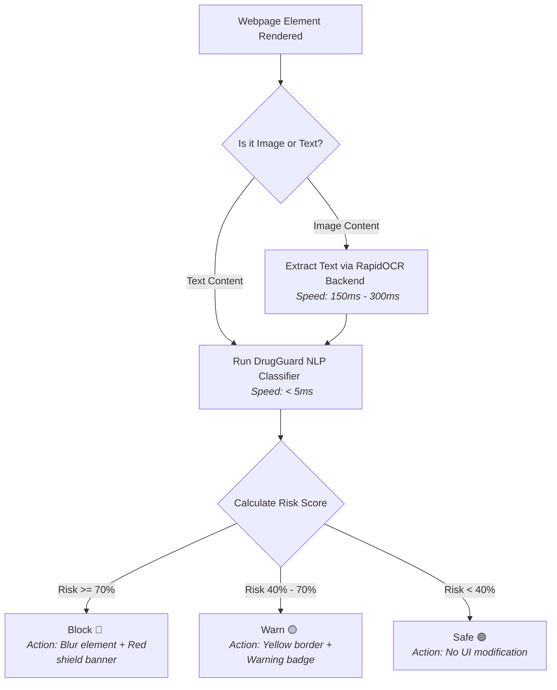

# 🛡️ DrugGuard: Algospeak-Resilient Semantic Detection of Illicit Drug Content


Online social platforms and messaging apps are increasingly exploited for illicit drug trafficking. To evade automated moderators, traffickers use a sophisticated linguistic strategy known as **Algospeak**—using emoji codes (e.g., `🍃` for weed, `❄️` for cocaine, `💊` for pills, `🔌` for dealer), leetspeak, intentional typos, and spaced letters. Standard keyword filters are easily bypassed by these methods, creating a pressing need for a system that understands the context and semantics of social media communications in real time.

**DrugGuard** solves this by providing a lightweight, high-performance, and algospeak-resilient browser extension powered by a machine learning backend. It dynamically scans webpage text, performs Optical Character Recognition (OCR) on image advertisements, and intervenes on the user interface (by blurring content or showing warning indicators) in milliseconds.

---

## 📷 Live Extension Screenshots & Sandbox Results

Here is the DrugGuard extension running locally and intercepting content on our custom test sandboxes:

| **1. Detection & Warning Intervention** | **2. Safe Content Allowed** | **3. High-Risk Content Blocked** |
| :---: | :---: | :---: |
|  |  |  |
| Borderline text elements are marked with a yellow border and warning icon. | Legitimate and everyday text remains completely untouched. | High-risk trafficking messages are blurred and hidden with a red shield banner. |

---

## ⚡ Performance, Scanning Speed & Latency Comparison

A primary engineering constraint was ensuring that web content scanning does not degrade browser rendering performance. The system achieves sub-millisecond latencies for real-time protection.

Here is a performance comparison of DrugGuard's semantic models against traditional filtering methods:

| Method | Scan Speed / Latency | Algospeak Resilient? | Handles Images? | Moderation Accuracy |
| :--- | :---: | :---: | :---: | :---: |
| **Traditional Keyword Filter** | ~1 ms | ❌ No | ❌ No | Low (easily bypassed) |
| **Traditional Regex Filter** | ~2 ms | ❌ No | ❌ No | Low (needs constant manual regex updates) |
| **DrugGuard NLP Classifier** | **< 5 ms** | **⚡ Yes** | ❌ No | **Very High (98.33% Accuracy)** |
| **DrugGuard Multimodal OCR** | **150 - 300 ms** | **⚡ Yes** | **⚡ Yes** | **Very High (Full Text + Image Extraction)** |
| **Traditional Vision/OCR (e.g. Tesseract)** | > 1200 ms | ❌ No | ⚡ Yes | Medium (creates significant page load lag) |

### Real-Time Decision & Scanning Pipeline
The flowchart below outlines the processing flow and execution times for scanning a single webpage element:



---

## ⚙️ Core Architecture & Features

### 1. Natural Language Processing (NLP) Backend
* **Robust Dataset**: Trained on 1,200 rows containing balanced drug trafficking templates, emoji-coded slang, and hard negatives (legitimate news reports, medical pharmacy guidelines, and standard marketplace listings).
* **Naive Bayes Classifier**: Utilizes `CountVectorizer` paired with a `MultinomialNB` model. The vectorizer is configured to treat emoji characters as valid features alongside alphanumeric tokens, allowing it to mathematically associate emojis like `💊` and `🔌` with trafficking patterns.

### 2. Live Browser Extension
* **Content Injection**: A Chrome extension content script that periodically scans the webpage DOM for text elements.
* **Intervention Actions**:
  - **Block (Risk ≥ 70%)**: Instantly blurs the text/image and overlays a red banner to hide illicit content.
  - **Warn (Risk 40-70%)**: Adds a warning badge and a yellow outline to suspicious elements.
  - **Safe (Risk < 40%)**: Leaves content untouched.

### 3. Multimodal Image OCR
* Integrated with `RapidOCR` on the `/predict_image` endpoint.
* Extracts embedded text from image flyers, posts, and ads (even with stylized fonts) and runs predictions on the extracted text.

---

## 🧪 Visual Test Cases

You can verify the live OCR scanning functionality using the generated flyer test cases in the project root:

| Test Image | Type | Description | Expected Model Action |
| :---: | :--- | :--- | :--- |
| **`drug_image.png`** | Illicit Flyer | Contains red styling and text: *"Special offer... Cocaine & powder available... Contact dealer"* | **Block** 🔴 (100% Risk) |
| **`safe_image.png`** | Safe Flyer | Contains green styling and text: *"Organic Japanese Matcha Tea... Rich in antioxidants"* | **Safe** 🟢 (0% Risk) |

---

## 📁 Repository Structure

```
.
├── ML-Dome/                  --> Backend ML, Server, and model assets
│   ├── app.py                --> Interactive CLI test app
│   ├── server.py             --> FastAPI server (handles /predict and /predict_image)
│   ├── train_model.py        --> Model training and evaluation script
│   ├── setup_dataset_v2.py   --> Synthetic dataset generator with hard negatives
│   ├── dataset.csv           --> Labeled dataset of 1,200 entries
│   ├── text_model.pkl        --> Saved trained Naive Bayes classifier
│   └── vectorizer.pkl        --> Saved vocabulary vectorizer
│
├── project/
│   └── extension/            --> Chrome Extension source code
│       ├── manifest.json     --> Extension manifest configuration
│       ├── content_script.js --> Live webpage DOM scanner & styling injector
│       └── popup.html/js     --> UI popup controller
│
├── algospeak_media/          --> Directory containing live test screenshots
│   ├── Screenshot 2026-06-11 234801.png
│   ├── Screenshot 2026-06-11 234935.png
│   └── Screenshot 2026-06-11 235049.png
│
├── drug_image.png / safe_image.png --> Pre-generated OCR test images
├── test_page.html            --> Extension test sandbox page (highly styled)
├── drug_test.html            --> Simple forum board test sandbox page
├── extension_preview.png     --> Extension preview banner image
└── README.md                 --> Main project documentation
```

---

## 🚀 How to Run Locally

### 1. Install Requirements
Ensure you have Python 3.8+ installed:
```bash
pip install pandas scikit-learn fastapi uvicorn pillow openpyxl rapidocr-onnxruntime requests
```

### 2. Start the Backend Server
Run the uvicorn API:
```bash
cd ML-Dome
python server.py
```
* Backend API documentation will be available at: `http://localhost:8000/docs`
* Health check: `http://localhost:8000/health`

### 3. Load the Browser Extension
1. Open Google Chrome and navigate to `chrome://extensions/`.
2. Enable **Developer mode** (top-right toggle).
3. Click **Load unpacked** (top-left button).
4. Select the `project/extension` folder from this repository.

### 4. Test Live Detection
Open the local test pages in your browser to see the extension scan, highlight, and blur blocks of text on the test page automatically:
* **Styled Extension Test Page**: 👉 `http://localhost:8000/static/test_page.html`
* **Street Market Forum Sandbox**: 👉 `http://localhost:8000/static/drug_test.html`
