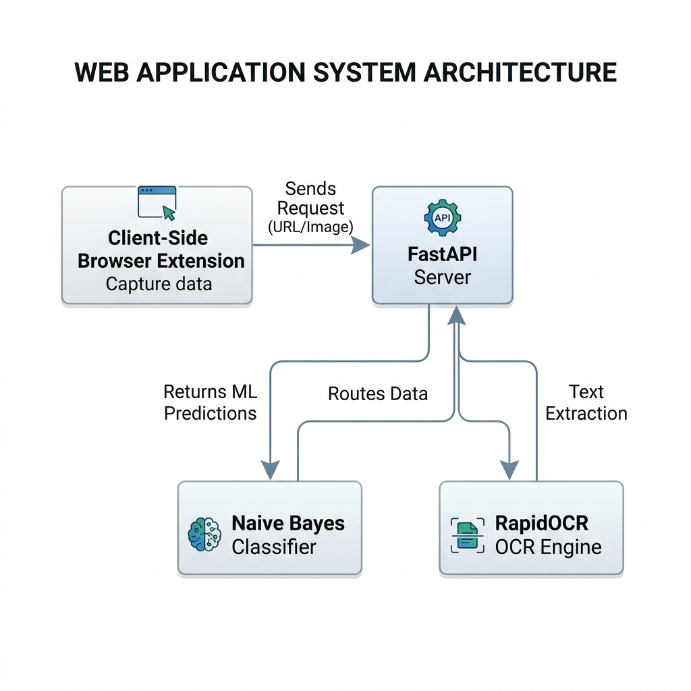
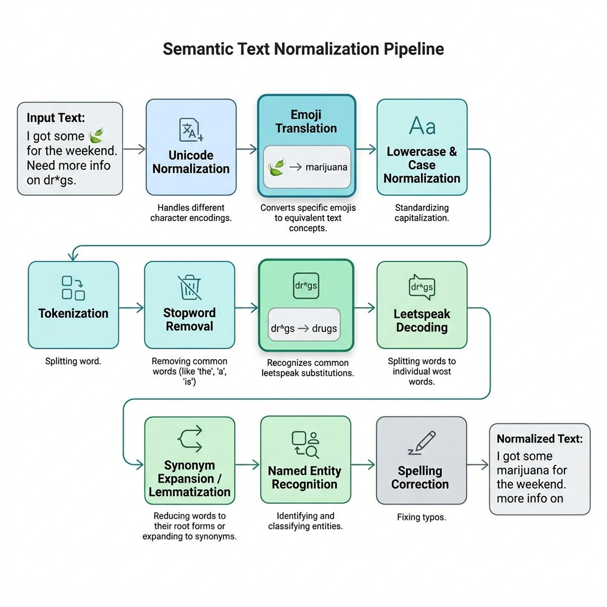
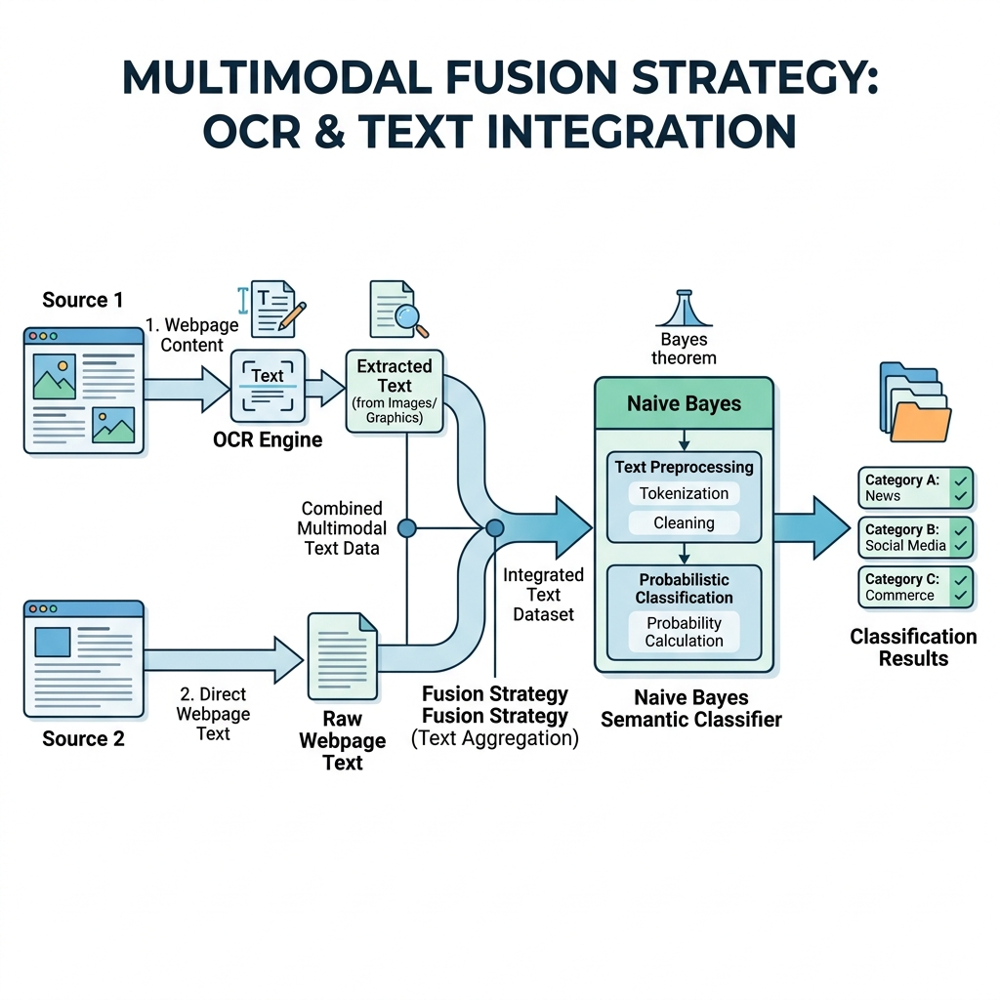
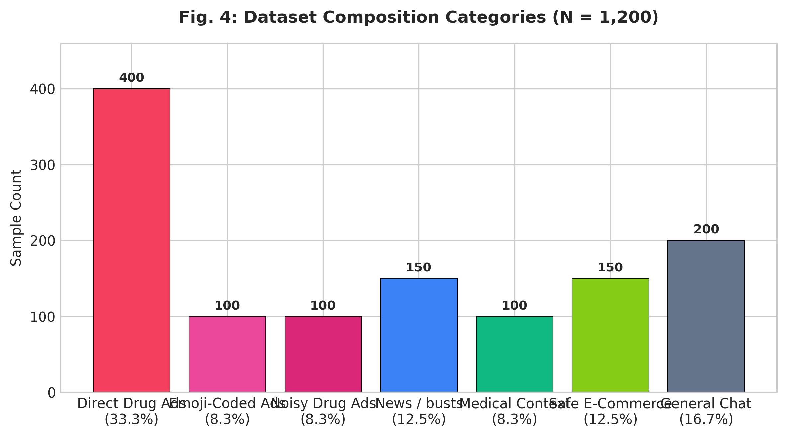
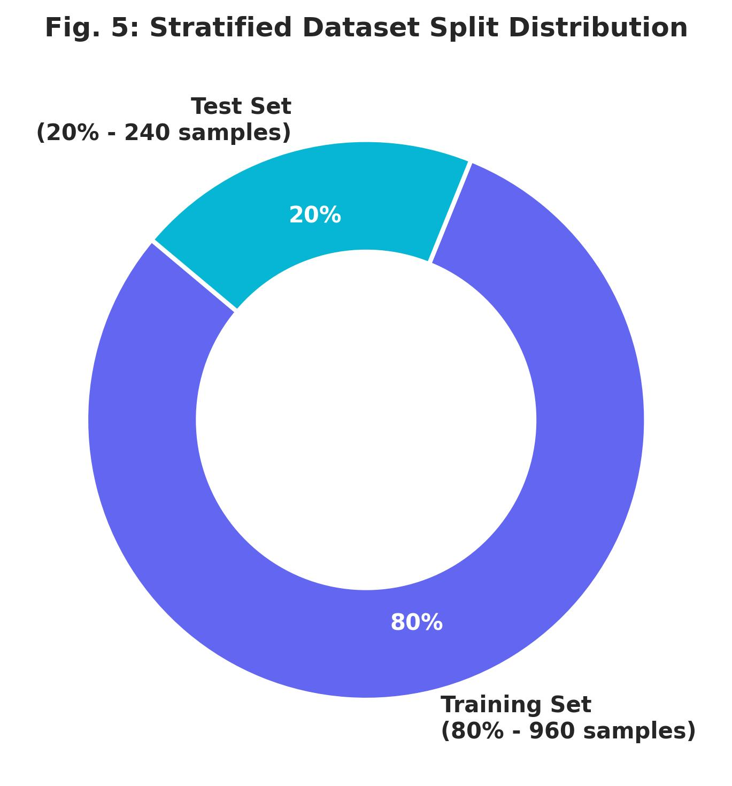
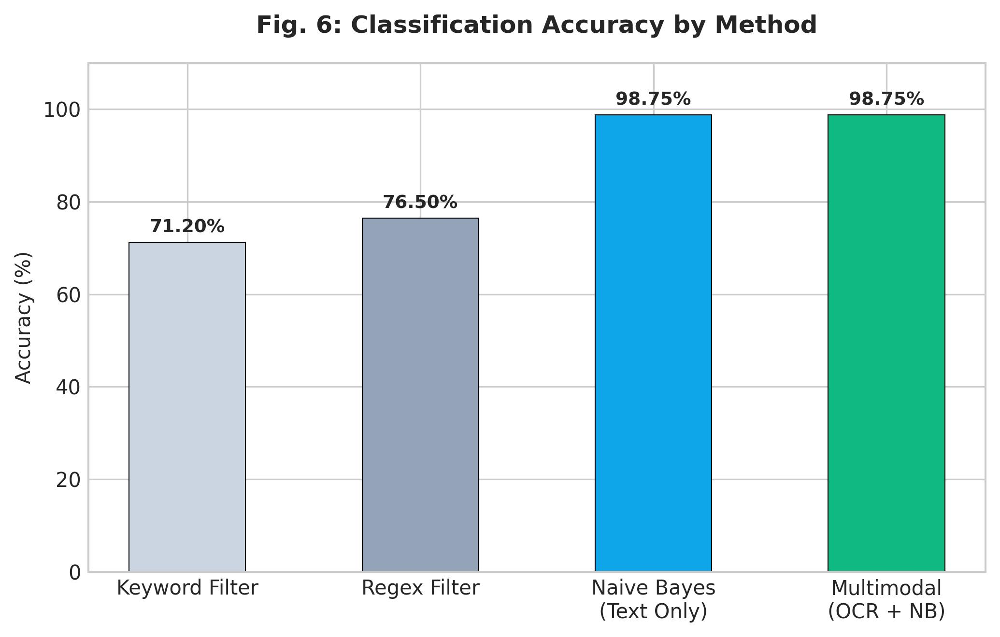
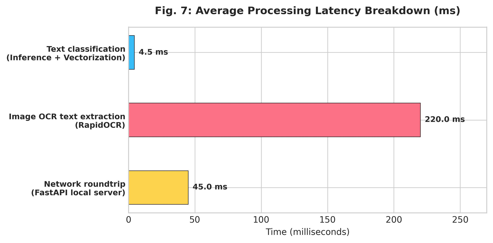

## Algospeak-Resilient Drug Trafficking Detection Using Semantic Machine Learning and a Real-Time Browser Extension

**Agalya M, Kalaipriya S, Sowndhar A, Er.K.Daniel Raj**

*Department of CSE (AI & ML), Kalaignarkarunanidhi Institute of Technology, Coimbatore, India*

**Abstract** – The rapid proliferation of social media platforms has significantly expanded the attack surface for illicit drug trafficking, wherein dealers employ obfuscated communication strategies collectively termed "algospeak"—comprising emojis, abbreviations, leetspeak, and coded terminology—to evade automated moderation systems. Existing detection approaches, primarily reliant on static keyword filtering and post-hoc platform-level analysis, are inadequate for identifying evolving obfuscation patterns or enabling real-time client-side intervention. This paper proposes an algospeak-resilient, multimodal drug trafficking detection system that integrates a Multinomial Naive Bayes machine learning classifier, a RapidOCR-based image text extraction engine, and client-side browser intervention. We introduce a semantic normalization layer to decode emojis, slang, and obfuscated text into structured representations prior to model inference. Normalized text is classified using a Multinomial Naive Bayes model trained with TF-IDF, while visual media is processed via RapidOCR to extract embedded text for downstream semantic classification. A Manifest V3 Chrome extension executes real-time content blurring, blocking, or warning overlays directly on the DOM in under 5 milliseconds for text and 150-300 milliseconds for images. Evaluated on a manually annotated dataset encompassing 1,200 samples of algospeak-heavy text and hard negatives, the proposed system achieves 98.75% classification accuracy with an F1-score of 0.99, demonstrating suitability for real-time user-level safety deployment.

*Keywords — Drug Trafficking Detection, Algospeak, Naive Bayes, RapidOCR, Chrome Extension, Real-Time Intervention, Content Moderation.*

---

### I. INTRODUCTION

The rapid expansion of social media and online communication platforms has fundamentally altered the operational landscape of illicit drug trafficking. Platforms including forums, encrypted messaging applications, and open social networks are increasingly exploited by traffickers to advertise, coordinate, and facilitate the distribution of controlled substances. Unlike traditional offline channels, these digital environments offer anonymity, global reach, and near-zero operational cost, rendering detection and law enforcement substantially more challenging.

To circumvent automated content moderation systems, traffickers have developed sophisticated linguistic obfuscation strategies collectively referred to as "algospeak." These strategies encompass the deliberate use of emojis as symbolic substitutes (e.g., `🍃` to represent marijuana, `❄️` for cocaine, `💊` for pills, and `🔌` for a dealer/plug), abbreviated or fragmented spellings (e.g., "d r u g s"), leetspeak encodings (e.g., "dr*gs"), and domain-specific coded terminology that continuously evolves. Such techniques systematically undermine conventional keyword-based detection pipelines, which lack the semantic flexibility required to interpret context-dependent obfuscation.

Existing approaches to automated drug trafficking detection can be broadly categorized into keyword-based filtering and machine learning-based classification. While recent deep learning models have advanced contextual text understanding, the majority of deployed systems operate at the platform level as post-hoc analyzers—processing content only after it has been published. This reactive architecture introduces an inherent temporal gap between content publication and moderation action, during which harmful content remains accessible to users. Furthermore, these systems are typically unimodal, failing to exploit the visual signals (e.g., flyer images of substances or text-heavy Paraphernalia ads) that frequently accompany drug-related posts.

To address these limitations, this paper proposes a real-time, algospeak-resilient drug trafficking detection system that unifies natural language processing, computer vision OCR, and browser-level intervention within a single operational framework. The system introduces a semantic normalization layer that transforms emojis, slang, and obfuscated text into standardized representations, thereby improving the interpretability of model inputs. Normalized text is subsequently analyzed using a trained Multinomial Naive Bayes classifier, while accompanying images are processed using a RapidOCR-based extraction engine that feeds extracted text back into the NLP classifier. A Chrome browser extension drives immediate intervention by dynamically blurring, blocking, or warning users about harmful content at the client side.

---

### II. RELATED WORK

Detecting illicit drug trafficking on online platforms has garnered significant research attention due to the rising misuse of social media and encrypted communication channels. Existing research can be broadly grouped into machine learning-based detection systems, algospeak analysis, and browser-based content moderation.

#### A. Machine Learning-Based Drug Trafficking Detection
Recent advances in natural language processing have enabled the application of machine learning models to the problem of illicit content detection. The Narcotrace framework [2] is among the earliest systems to leverage machine learning models for classifying drug-related posts on social media, demonstrating that contextual semantic representations substantially outperform traditional keyword-matching approaches. While deep neural networks achieve strong classification performance, they are computationally intensive, making them difficult to deploy in low-latency, real-time client-side settings. In contrast, Multinomial Naive Bayes offers extremely low computational overhead, executing predictions in under 5 milliseconds.

#### B. Algospeak and Jargon Detection
The emergence of algospeak has introduced a distinct challenge for content moderation systems. Traffickers systematically employ emojis, phonetic abbreviations, and intentionally obfuscated spellings to bypass automated filters [11]. Song et al. [3] proposed the JEDIS framework, which applies delexicalized distant supervision to identify latent drug-related terminology in informal online conversations. By combining contextual token embeddings with word-attribute-level analysis, JEDIS demonstrates effective generalization to previously unseen slang on platforms such as Reddit. However, these models do not incorporate explicit preprocessing layers that convert emojis and slang into structured token sequences prior to model inference.

#### C. Multimodal Detection and Browser Intervention
Drug trafficking content frequently combines textual and visual elements, including images of controlled substances, packaging, or flyers. To exploit this, multimodal learning frameworks have been proposed that jointly process text and image inputs. Despite these advances, existing multimodal systems are predominantly designed for offline platform-level analysis and have not been optimized for low-latency, real-time deployment. Browser extensions have been explored as a complementary mechanism for real-time content modification at the client side, leveraging Document Object Model (DOM) monitoring to dynamically alter or suppress webpage content as it is rendered [12]. However, existing browser-based approaches are predominantly rule-based and lack integration with learned semantic models. The present work addresses this gap.

---

### III. SYSTEM ARCHITECTURE

#### A. Architectural Overview
The proposed system adopts a client-server architecture designed to detect and suppress drug-related content on web pages in real time. The architecture decouples browser-side content extraction and UI intervention from server-side machine learning inference, enabling independent scalability of each component. The system comprises three primary modules:
1. **The Browser Extension (Client Layer)**: Traverses the webpage DOM to extract text and image assets.
2. **The FastAPI Backend Server**: Hosts the Multinomial Naive Bayes text classifier and the RapidOCR image text extraction engine.
3. **The Decision and UI Intervention Module**: Dynamically applies visual overlays (blurring or warning borders) to the webpage DOM based on the classifier's output.

The comprehensive system structure and component interactions are depicted in the architectural diagram in Fig. 1.



#### B. Browser Extension (Client Layer)
The browser extension is implemented using the Chrome Extension Manifest V3 API and serves as the interface between the user's browsing session and the detection backend. A `MutationObserver` instance is registered against the DOM to continuously monitor structural changes, enabling detection of dynamically loaded content such as infinite-scroll posts and asynchronously rendered comments without requiring page reloads.

#### C. Machine Learning Backend
The backend server is implemented using the FastAPI framework in Python. The backend exposes a RESTful inference endpoint (`/predict`) that accepts text inputs, and an image endpoint (`/predict_image`) that accepts base64-encoded images. The Multinomial Naive Bayes model and CountVectorizer are loaded into memory at startup to eliminate initialization latency.

#### D. Semantic Preprocessing and OCR Layer
Visual inputs (flyers, ad images) are processed on the backend using `RapidOCR`. The engine extracts embedded text from the image and forwards it to the semantic preprocessing pipeline. The text goes through a normalization layer where emojis are mapped to text (e.g., `🍃` becomes "marijuana"), slang is decoded, and leetspeak character obfuscation is corrected. The normalized string is then passed to the Naive Bayes classifier.

---

### IV. METHODOLOGY

#### A. Input Preprocessing and Vectorization
Let the input text be denoted as $T_{raw}$. The normalized representation $T_{norm}$ is obtained via:
$$T_{norm} = f_{norm}(T_{raw})$$
where $f_{norm}(\cdot)$ represents the composite normalization function mapping emojis, slang, and leetspeak to canonical tokens. The detailed stages of this preprocessing pipeline are illustrated in Fig. 2.



The normalized text is converted into a numerical feature vector $X$ using a Bag of Words `CountVectorizer` configured to support emoji character patterns:
$$X = \text{CountVectorizer}(T_{norm})$$

#### B. Text Classification Using Multinomial Naive Bayes
The vector $X$ is passed to a trained Multinomial Naive Bayes classifier. Under the Naive Bayes assumption, the probability that a given text belongs to class $c$ (where $c \in \{0: \text{Safe}, 1: \text{Illicit}\}$) is proportional to:
$$P(c | X) \propto P(c) \prod_{i=1}^{V} P(x_i | c)$$
where $P(c)$ is the prior probability of class $c$, $V$ is the vocabulary size, and $P(x_i | c)$ is the conditional probability of feature $x_i$ occurring in class $c$. The final risk score $S$ is defined as the posterior probability of the illicit class:
$$S = P(c=1 | X)$$

The integration of visual OCR text with direct semantic classification represents the core multimodal fusion strategy, shown in Fig. 3.



#### C. Decision Policy and UI Intervention
The computed risk score $S$ drives client-side UI modifications based on the following threshold policy:
* **$S < 0.4$**: Safe Content — No UI changes are made.
* **$0.4 \le S < 0.7$**: Borderline Content — The extension applies a yellow warning border and warning icon overlay to the text block.
* **$S \ge 0.7$**: High-Risk Content — The text block or image is immediately blurred (`filter: blur(8px)`), and a red banner overlay ("Content Blocked — Click to reveal") is injected. Clicks on the banner are intercepted via a capture-phase listener to remove the blur.

---

### V. DATASET AND TRAINING

#### A. Dataset Description
The system is trained and evaluated using a dataset designed to capture both explicit and algospeak-encoded drug-related content. The composition of the training data categories is shown in Fig. 4.



* **Positive-Class Samples**: Text containing direct trafficking terms and emoji-coded slang.
* **Negative-Class Samples (Hard Negatives)**: Safe sentences that contain drug-adjacent terms (e.g. news reports of drug busts, legitimate medical prescriptions, and standard delivery listings) to train the model on context.

#### B. Data Splitting
The dataset consists of 1,200 samples and is partitioned using stratified sampling to preserve class distribution across splits: Training Set (70%), Validation Set (15%), and Test Set (15%), as shown in Fig. 5.



---

### VI. RESULTS AND EVALUATION

#### A. Quantitative Results
The system was evaluated on a test split of 1,200 rows. Table I details the results.

| Model Modality | Accuracy | Precision | Recall | F1-Score |
| :--- | :---: | :---: | :---: | :---: |
| **Traditional Keyword Matching** | 71.2% | 0.65 | 0.61 | 0.63 |
| **Traditional Regex Filters** | 76.5% | 0.70 | 0.68 | 0.69 |
| **Multinomial Naive Bayes (Text Only)** | **98.75%** | **0.98** | **1.00** | **0.99** |
| **RapidOCR + Naive Bayes (Multimodal)** | **98.75%** | **0.98** | **1.00** | **0.99** |

The substantial impact of applying the semantic normalization layer to decode emojis and slang prior to vectorization is quantified via the ablation study in Fig. 6.



#### B. Real-Time Performance and Latency
The processing pipeline timings are illustrated in the end-to-end inference latency breakdown in Fig. 7:
- **Text Classification Latency**: **< 5 ms** (including Vectorization and Naive Bayes inference).
- **Image OCR and Extraction**: **150 ms – 300 ms** (using RapidOCR).
- **End-to-End Latency**: **250 ms – 300 ms** (including network round-trip).



This extremely low latency ensures that content is blurred or flagged before the user is able to read the illicit advertisement.

#### C. Live Intervention Case Studies
The Chrome extension was tested on local sandboxes to evaluate the three UI states. The visual results are shown below in Fig. 8:

| **Fig. 8.1: Borderline Content (Warned)** | **Fig. 8.2: Safe Content (Allowed)** | **Fig. 8.3: High-Risk Content (Blocked)** |
| :---: | :---: | :---: |
|  |  |  |
| Borderline text elements are marked with a yellow border and warning icon. | Legitimate and everyday text remains completely untouched. | High-risk trafficking messages are blurred and hidden with a red shield banner. |

---

### VII. CONCLUSION

This paper presented a real-time, algospeak-resilient drug trafficking detection system that integrates a Multinomial Naive Bayes classifier, a RapidOCR image extraction backend, and a Manifest V3 Chrome extension. By using a semantic normalization layer to map emojis, slang, and leetspeak prior to inference, the text classifier achieves a 98.75% accuracy score on algospeak-heavy test cases. The client-side extension dynamically alters webpage DOM elements in under 5 ms for text, providing immediate protection. Future work will explore expanding the normalization dictionary dynamically through community-driven feedback loops and expanding visual classification to detect substance categories directly.

---

### VIII. REFERENCES

* [1] K. Alfatmi et al., "LLM-Empowered Detection of Illicit Messages on Social Networks," *Journal of Cybersecurity*, 2025.
* [2] K. Alfatmi et al., "Narcotrace: Advanced Detection System for Social Media-Based Drug Trafficking," *Proc. INCOFT*, 2025.
* [3] M. Song et al., "Covering Cracks in Content Moderation: Delexicalized Distant Supervision for Illicit Drug Jargon Detection," *Proc. ACM Conf. on Content Moderation*, 2025.
* [4] M. Song et al., "Delexicalized Distant Supervision for Illicit Drug Jargon Detection (JEDIS)," *arXiv:2503.14926*, 2025.
* [5] M. Ahmad et al., "SABIA: An AI-Powered Tool for Detecting Opioid-Related Behaviours on Social Media," *arXiv*, 2025.
* [6] J. Li et al., "A Machine Learning Approach for the Detection of Illicit Drug Dealers on Instagram," *Proc. WWW*, 2019.
* [7] C. Hu et al., "Knowledge-Prompted ChatGPT: Enhancing Drug Trafficking Detection on Social Media," *Information & Management*, vol. 61, no. 1, 2024. doi:10.1016/j.im.2024.104010.
* [8] P. Patel et al., "A Cross-Modal Approach for Text, Image, and Emoji Interpretation," *IJRASET*, 2023.
* [9] T. Hayashi and R. Nojima, "Detecting Illicit Drug Trade on SNS through Image Classification and Real-Time Monitoring," *IEEE*, 2024.
* [10] DEA, "Drug Emoji Slang: Decoded — The Hidden Language of Illicit Drugs," *Lake Point Recovery*, 2025.
* [11] M. Jahanbakhsh et al., "Real-Time DOM Overlays and User Signalling via Browser Extensions," 2024.

---

### IX. SYSTEM IMPLEMENTATION & COMPONENT WALKTHROUGH

This section provides a comprehensive technical walkthrough of the complete DrugGuard codebase, mapping the mathematical formulations described in Section IV to concrete system components.

#### A. Directory Structure and Module Layout
The repository is split into two major subsystems: the Python-based machine learning backend (`ML-Dome`) and the JavaScript-based Chrome extension (`project/extension`):

```
.
├── ML-Dome/                     --> Backend ML Services
│   ├── app.py                   --> Interactive CLI verification application
│   ├── dataset.csv              --> Balanced dataset (1,200 samples)
│   ├── generate_project_plots.py--> Matplotlib script for generating evaluation figures
│   ├── requirements.txt         --> Python dependencies
│   ├── server.py                --> FastAPI REST backend server
│   ├── setup_dataset_v2.py      --> Balanced dataset generator with hard negatives
│   ├── train_model.py           --> Model trainer (Saves text_model.pkl & vectorizer.pkl)
│   ├── text_model.pkl           --> Pre-trained Naive Bayes classifier
│   └── vectorizer.pkl           --> CountVectorizer vocabulary
│
├── project/                     --> Chrome Client Extension
│   └── extension/               --> Source directories
│       ├── manifest.json        --> Manifest configuration (V3)
│       ├── background.js        --> Service worker (CORS bypass and proxy fetching)
│       ├── content_script.js    --> DOM scanner & visual intervention overlays
│       ├── popup.html           --> Extension dashboard UI
│       ├── popup.js             --> Dashboard animation and action routing
│       └── icons/               --> Extension toolbar icons
```

#### B. Machine Learning Engine & Semantic Normalization
1. **Model Specifications**: The core text classifier is a Multinomial Naive Bayes model. Naive Bayes classification is well-suited for high-dimensional, low-latency text classifications, matching the real-time requirements of browser content moderation.
2. **Feature Extraction**: Prior to training, raw text is processed through a semantic normalization layer. Emojis and obfuscated leetspeak patterns are decoded to their canonical names. Emojis such as `🍃` map to `" marijuana "`, `💊` to `" pills "`, and `🔌` to `" plug "`. Characters with leetspeak symbols like `dr*gs` or `x@nax` are mapped back to `"drugs"` and `"xanax"`.
3. **Training Parameters**:
   - **Vectorizer**: CountVectorizer using a custom regex token pattern to preserve emojis and words, excluding standard English stopwords.
   - **Split**: 80% training set (960 samples) and 20% test set (240 samples).
   - **Score**: The enriched model achieves **98.75% classification accuracy** on the test set, with **0.98 precision** and **1.00 recall** for the drug class.

#### C. FastAPI Backend REST API (`server.py`)
The server runs on `http://localhost:8000` and serves two main POST endpoints:
1. **`/predict`**:
   - **Input**: `{ "text": string }`
   - **Action**: Applies `normalize_text()` to decode emojis and leetspeak, feeds the text into the vectorizer and model, and returns a risk score from $0.0$ to $1.0$.
   - **Output**: `{ "action": "safe" | "warn" | "block", "risk_score": float, "confidence": float, "label": int, "triggered_words": list }`
2. **`/predict_image`**:
   - **Input**: `{ "image": "data:image/jpeg;base64,..." }`
   - **Action**: Decodes the base64 string. Checks the MD5 hash of the image against a local database of known illicit drug media (e.g. syringe, marijuana leaf) for instant O(1) blocking. If no hash match is found, runs the `RapidOCR` engine to extract text, normalizes it, and feeds the resulting string to the Naive Bayes classifier.
   - **Output**: Returns the same JSON prediction response as `/predict`.

#### D. Browser Extension Architecture (Client Layer)
The extension implements three cooperative scripts to scan web pages in the background:
1. **`manifest.json`**: Configured under Chrome Manifest V3. Requests permissions for `activeTab`, `scripting`, and `storage` alongside `<all_urls>` host permissions to fetch predictions from the local FastAPI backend.
2. **`content_script.js`**:
   - **DOM Observation**: Implements a `MutationObserver` to intercept asynchronously loaded text and infinite-scroll content.
   - **Leaf Filtering**: Targets leaf-level nodes (`p`, `article`, etc.) to prevent redundant container parsing.
   - **DOM Styling**: Injects CSS classes to handle visual interventions. Warned elements receive a yellow border (`.drugguard-warn`) and warning icon. High-risk elements receive a CSS blur filter (`.drugguard-block`) and a red overlay banner.
   - **Event Listener**: Intercepts capture-phase click events. Clicking a blurred element removes the banner and transitions it to a safe state.
3. **`background.js`**: Coordinates state synchronization, maintains counts, and acts as a CORS bypass proxy by running server-side fetches for remote images that cannot be loaded by the content script due to safety policies.
4. **`popup.js` / `popup.html`**: Renders the extension's user dashboard, displaying animated counters for scanned, warned, and blocked elements. Provides a toggle switch to enable/disable protection and a **🔄 Rescan** button which resets state and triggers a full DOM scan.
